# 👋 Hi, I'm Ahmad Hassan

### Full-Stack Developer · C++ Enthusiast · Python Tinkerer

---

## 📊 GitHub Overview

---

## 📅 Contributions Calendar

---

## 🏆 Achievements & Highlights

| 🥇 Achievements | 📆 Full Commit History |
|:---:|:---:|
|  |  |

---

## 👨‍💻 Lines of Code Changed

---

## 🌟 Recently Starred

---

## 🎩 Notable Contributions

---

## 🚀 Featured Projects

---

*Metrics auto-generated every 6 hours by [lowlighter/metrics](https://github.com/lowlighter/metrics)*

